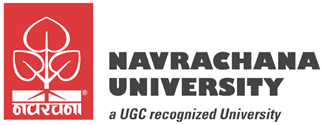

# Navrachna University Website

This repository contains the source code for the informative website of Navrachna University. The website provides detailed information about the university's programs, schools, application processes, contact details, and semester timetables.

  

## Features

- **Home Page**: A welcoming introduction to Navrachna University with a navigation menu.
- **About Us**: Information about the Education Society, Office of the Registrar, and contact details.
- **Schools**: Details about various schools:
  - School of Engineering and Technology (SET)
  - School of Science (SOS)
  - School of Liberal Studies and Education (SLSE)
  - (Additional schools like SBL and SEDA can be added as developed)
- **Programs**: List of programs offered, including BTech CSE, BSc, MSc, BCA, MTech, BEd, PhD, and more.
- **Apply Now**: Application form for prospective students and document upload section.
- **Timetables**: Semester-wise timetables, such as BTech CSE Semester 2.

## Directory Structure

- `/`: Root directory containing main HTML files (e.g., `index.html`).
- `/css/`: CSS stylesheets for styling the website (e.g., `apply.css`, `edu.css`).
- `/img/`: Images used in the website (e.g., `Picture2.png`, `Degree-Program.png`).
- `/semesters/`: (Optional) Directory for semester timetable files (e.g., `sem_2.html`).

## Pages Included

- `index.html`: Home page with navigation to all sections.
- `education.html`: Details about the Navrachana Education Society.
- `office_of_registrar.html`: Information about the Office of the Registrar.
- `contact_us.html`: Contact details of Navrachna University.
- `set.html`: School of Engineering and Technology with BTech CSE semester links.
- `sos.html`: School of Science with degree program details.
- `slse.html`: School of Liberal Studies and Education with degree programs.
- `apply_now.html`: Application form for personal details.
- `upload_file.html`: Document upload form for students.
- `sem_2.html`: Semester 2 timetable for BTech CSE.

## Features

- **Home Page**: A welcoming introduction to Navrachna University with a navigation menu.
- **About Us**: Information about the Education Society, Office of the Registrar, and contact details.
- **Schools**: Details about various schools:
  - School of Engineering and Technology (SET)
  - School of Science (SOS)
  - School of Liberal Studies and Education (SLSE)
  - (Additional schools like SBL and SEDA can be added as developed)
- **Programs**: List of programs offered, including BTech CSE, BSc, MSc, BCA, MTech, BEd, PhD, and more.
- **Apply Now**: Application form for prospective students and document upload section.
- **Timetables**: Semester-wise timetables, such as BTech CSE Semester 2.

